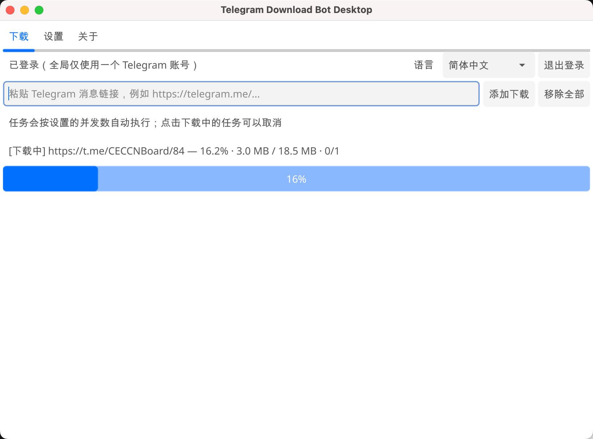

# telegram-download-bot

[English](README.md) | 中文说明

## 桌面端



下载地址：[GitHub Releases](https://github.com/ConnectingEveryCorner/telegram-download-bot/releases) https://pan.quark.cn/s/b0206663ed62

### macOS 首次打开

当前 macOS 应用未进行 Apple 签名与公证，若系统提示应用已损坏，请将应用移动到“应用程序”目录后在终端执行

```bash
xattr -cr "/Applications/TelegramDownloadBotDesktop.app"
```

telegram-download-bot 是一个基于 [tdl](https://github.com/iyear/tdl) 实现的 Telegram MTProto 下载回传机器人 用户把 Telegram 消息链接发给机器人后，机器人会使用已登录的 Telegram 用户账号下载原消息内容，再通过机器人把文本、图片、视频、文件或相册回传给当前聊天


## 功能

- 通过 Telegram Bot 接收 Telegram 消息链接
- 使用已登录的 MTProto 用户账号下载消息内容
- 通过机器人回传文本、图片、视频、文件和相册
- 在机器人流程内登录 Telegram 用户账号
- 仅管理员可管理授权
- 通过配置固定机器人语言，目前支持英文和中文

## 配置

先复制配置：

```bash
cp config.example.yaml config.yaml
```

然后编辑 `config.yaml`：

```yaml
bot:
  token: "YOUR_TELEGRAM_BOT_TOKEN"
  debug: false
  language: "en"

telegram:
  app-id: 123456
  app-hash: "YOUR_TELEGRAM_APP_HASH"

auth:
  admin-chat-id: 123456789
  allowed-chat-ids: []

tdl:
  proxy: ""
  ntp: ""
  reconnect-timeout: "5m"
  threads: 4
  limit: 2
  pool: 8
  delay: "0s"
```

重要字段：

- `bot.token`：来自 BotFather 的 Bot Token
- `bot.language`：必填的机器人语言，只支持 `en` 和 `zh`
- `telegram.app-id` 和 `telegram.app-hash`：Telegram API 凭据
- `auth.admin-chat-id`：主管理员 chat id
- `auth.allowed-chat-ids`：允许使用机器人的普通用户
- `tdl.proxy`：可选代理，例如 `socks5://127.0.0.1:7890`

如何获取 `telegram.app-id` 和 `telegram.app-hash`：

1. 打开 [my.telegram.org](https://my.telegram.org/) 并使用 Telegram 手机号登录
2. 进入 **API development tools**
3. 如果还没有应用，先创建一个应用
4. 把页面显示的 `api_id` 填到 `telegram.app-id`，把 `api_hash` 填到 `telegram.app-hash`

语言是全局配置，用户不能在聊天里选择或切换语言 如果 `bot.language` 是 `en`，机器人提示使用英文 如果是 `zh`，机器人提示使用中文

## Docker Compose 部署

https://youtu.be/3rKaZDRmR5Q?si=rX-s2s5y2Ay-4ENg

从本仓库手动下载 `docker-compose.yml` 和 `config.example.yaml`，并把它们放到同一个部署目录

复制 `config.example.yaml` 为 `config.yaml`，然后在 `config.yaml` 中填写 Bot Token、Telegram API 凭据和管理员 chat id

启动机器人：

```bash
docker compose up -d
```

## 机器人命令

- `/start`：显示帮助
- `/help`：显示帮助
- `/myid`：显示当前 chat id
- `/login`：主管理员登录共享的 Telegram 账号
- `/login +4475834875`：主管理员直接带手机号登录共享账号

`/login` 仅允许 `auth.admin-chat-id` 配置的主管理员执行。登录成功后，所有已授权的机器人用户共享该 Telegram 登录状态，无需分别登录
- `/status`：检查登录状态
- `/logout`：清除当前账号会话
- `/cancel`：取消当前登录流程
- `/grant <chat_id>`：主管理员授权用户
- `/revoke <chat_id>`：主管理员撤销用户授权
- `/users`：主管理员查看授权状态

登录后，直接发送 Telegram 消息链接即可下载并回传

## 联系方式 💬

- 🌐 官网: [ceckit.com](https://ceckit.com/)
- 🤖 机器人: [@ConnectingEveryCornerCNBot](https://telegram.me/ConnectingEveryCornerCNBot)
- 👤 Telegram: [@ConnectingEveryCorner](https://telegram.me/ConnectingEveryCorner)
- 📢 频道: [CECCNBoard](https://telegram.me/CECCNBoard)

## 许可证

本项目使用 AGPL-3.0 许可 完整 AGPL-3.0 许可证文本归档在 `licenses/LICENSE.upstream-AGPL-3.0.txt` 项目许可说明见当前 `LICENSE` 文件
